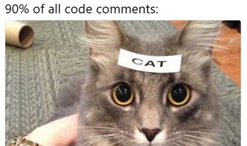
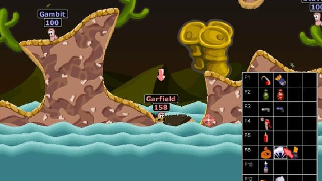
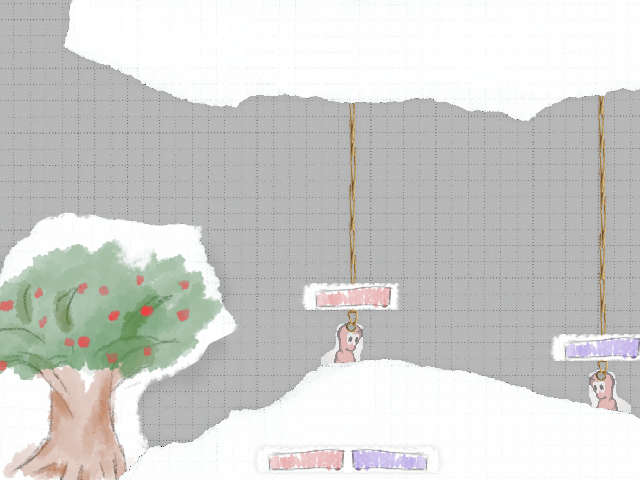
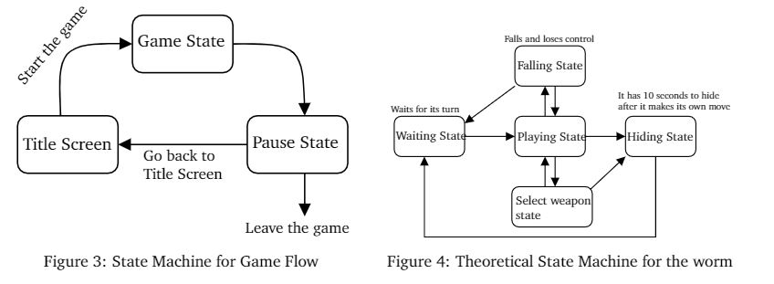

# efb56ad3-gr12-repo
## Worms - SFML & Box2D Clone
Status: ❌ not approved yet

Status of the code:

### Current description of the project and some sketches
[PDF version of the current description and some sketches](Dawid_Grobert_Topic_Description_and_sketch_of_UI.pdf)

#### The general idea
The main idea of the project is to prepare a game similar to *Worms*. The idea is quite big and complicated, but programming most of the mechanisms making the game similar (not exact) to *Worms* should be possible to do in time of two studying blocks. The game would use the libraries *SFML*, *Box2D* and very possibly a few others like *Clipper*.

#### What are worms?
Worms are turn-based artillery games presented in 2D environment. Each player has his own worm team consisting of X worms. Subsequently each player in his turn can move one worm from his team (there is no choice here, they are chosen in turn). Each worm has its own arsenal of weapons that it can replenish over the course of the game. To win a player have to defeat all opponent's worms.

An exemplary Worms 2 screenshot

During gameplay, the map is gradually flooded, causing the worms to have to flee up the map. The terrain is fully destructible by the arsenal of weapons of the worms.

#### What can go wrong?
The Worms themselves are very complicated. I certainly won't be able to fully recreate the original. First of all, Box2D in combination with SFML is quite difficult to use. For example, the standard measure on which Box2D operates (meters) has to be converted to pixels. There are only a few good sources on the internet, so I have to mostly rely on official documentation. Many elements may be missing in my version, but I will try to make the end result a playable game. 

For many of the elements, I still have no idea how they will be implemented, but I believe that durning the creation process I will be able to create something that satisfies me.

#### What I will create first
I will start by creating a certain game base which will consist of mechanisms such as:

 - Scenes and nodes (similar to how they work in Godot Engine)
 - StateStack
 - Walking in the world
 - Shooting
 - Weapon selection
 - And finally gameplay mechanics such as the order in which players take their turns. Interactions between the game world. And finally cosmetic improvements.

#### Sketch of the interface
I thought I would like to make a game that visually resembles a paper theatre. I don't have enough time to prepare all the sketches yet, although I have created an overview sketch.

The style of the game will rather try to emulate hand-drawn objects on pieces of paper. Although initially the prototype may use images similar to the original *Worms*.

#### More detailed description
The game will launch and greet player with a friendly main menu. The player will be able to choose the number of worms on the board and probably name them too. The gameplay will then begin -- the essential core of the game. StateStack will most likely be used here more than twice. For example, one StateStack will control the operation of the entire application (see Fig. 2). A second StateStack, for example, may control the entire gameplay or even an individual worm (see Fig. 3). Of course, the diagrams provided here are still purely theoretical.

It's hard to predict what the end result will look like, and it's likely that a project of this type always looks different from the initial sketches and diagrams. However, I think this is what the approximate work on this project will look like nevertheless.